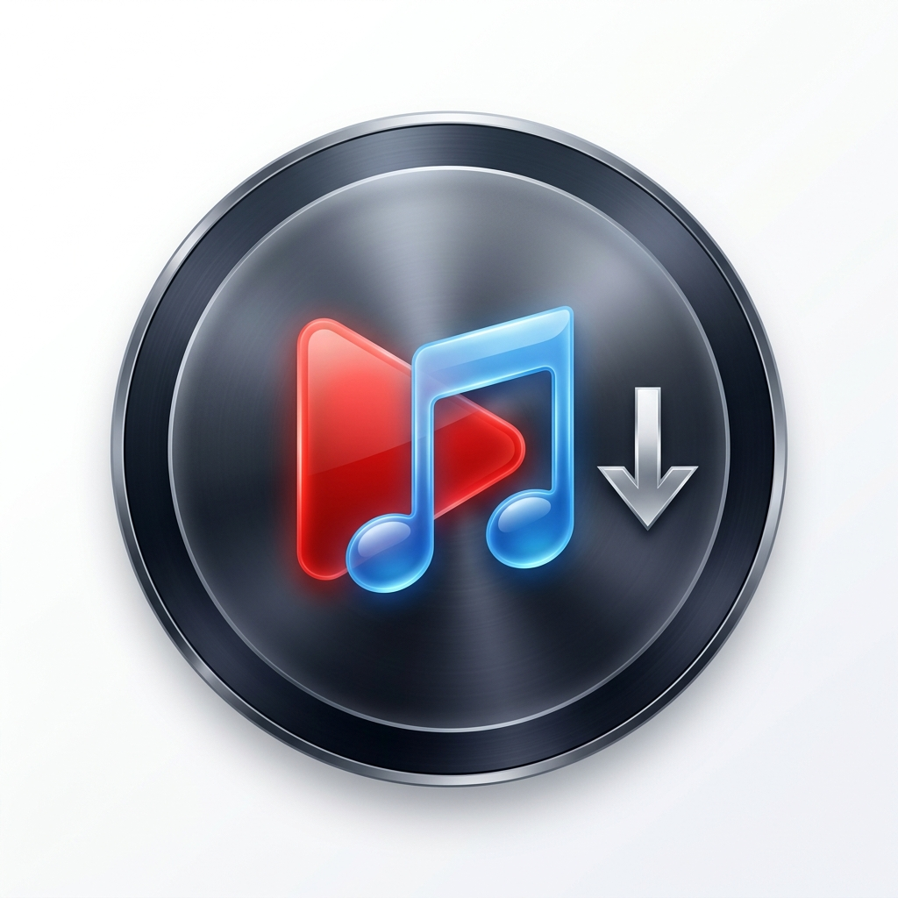

<p align="center">
  
</p>

<h1 align="center">YouTube Music Downloader</h1>

<p align="center">
  A premium, high-fidelity YouTube and YouTube Music downloader built with Python and PySide6. Features asynchronous queue management, automated dependencies setup, smart playlist subdirectory grouping, and resilient network/content retry loops.
</p>

<p align="center">
  
  
  
  
  <a href="LICENSE"></a>
</p>

---

## 🎥 Video Guide

To see the downloader in action and learn how to use its features, watch the quick guide below:

<p align="center">
  <video src="https://github.com/user-attachments/assets/bf968b47-4759-4b0a-890e-3fcda3dd1228" width="600" height="360" controls>
    Your browser does not support the video tag.
  </video>
</p>

---

## 🌟 Key Features

*   **Premium Quality Audio Extraction**: Extracts the best available audio stream from YouTube/YouTube Music and encodes it into high-fidelity 320kbps MP3s.
*   **Smart Playlist/Album Directories**: Automatically organizes downloads by creating dedicated subfolders named after the playlist or album inside your target downloads directory.
*   **Metadata & Art Tagging**: Automatically embeds rich metadata (Song Title, Artist, Album) and square-crops the thumbnail to inject clean cover art into the MP3 headers.
*   **Zero-Config Dependency Engine**: Checks `dist/bin/` on startup. If `yt-dlp.exe`, `ffmpeg.exe`, or `ffprobe.exe` are missing, it automatically downloads and configures the latest releases in the background.
*   **Resilient Downloader Threading**: Programmed with smart retries (exponential backoff) for both network disconnects and age-gate/content warnings.
*   **Graceful Queue Summary & Retry**: Displays a detailed summary modal when all downloads finish, listing successful tracks versus errored tracks, with a single-click button to retry only the failed tracks.
*   **Responsive Window Geometry**: Dynamically adjusts its initial size to exactly **60% of your screen width and height** on first launch and centers itself perfectly. Manually adjusted sizes are automatically remembered and restored.
*   **Duplicate Checking**: Skips downloading tracks that are already up-to-date in your directory, using a cross-download database cache to save bandwidth.

---

## 🛠️ Tech Stack

*   **GUI Library**: PySide6 (Qt for Python) with styled flat dark themes.
*   **Download Core**: yt-dlp.
*   **Audio Processor**: FFmpeg / FFprobe.

---

## 🚀 Getting Started

### Option A: Running from Code (Developer Mode)

#### 1. Prerequisites
Make sure you have [Python 3.10+](https://www.python.org/downloads/) installed.

#### 2. Install Dependencies
Clone this repository, open your terminal/command prompt in the project folder, and run:
```bash
pip install -r requirements.txt
```

#### 3. Run the Application
Start the app using the root entry script:
```bash
python simple-ytmusic-downloader.py
```
*Note: On your first startup, the dependency window will appear to download `yt-dlp` and `ffmpeg` binaries automatically.*

---

### Option B: Compiling to Standalone Executable (Windows)

If you want to compile the project into a single `.exe` file that runs portably without requiring Python:

1. Install PyInstaller:
   ```bash
   pip install pyinstaller
   ```
2. Run the packaging command:
   ```bash
   pyinstaller --onefile --windowed --name YTMusicDownloader --icon=public/app_icon.ico --add-data "public/app_icon.png;public" --hidden-import PySide6.QtSvg --hidden-import PySide6.QtXml src/main.py
   ```
3. Your compiled standalone executable will be generated inside the `dist/` folder as `YTMusicDownloader.exe`.

---

## 📄 License
This project is licensed under the [MIT License](LICENSE).

